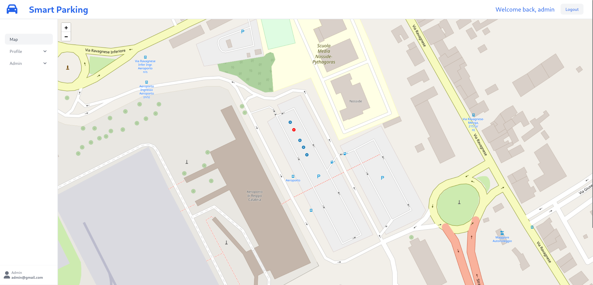

# Smart Parking RC



Smart Parking RC è un applicazione Web che permette di acquista biglietti per le soste a pagamento a Reggio Calabria.
E' principalemente scritta in php utilizzando il framework Laravel.
L'utente dopo essersi registrato potrà acquistare tramite moneta del credito che andrà ad utilizzare per pagare la sosta nei parcheggi.
IL costo della sosta è si 1.00 €/h.
Per ogni sosta l'utente dovrà indicare il parcheggio nel qualche si trova o utilizzare la mappa interattiva cliccando su di esso.
L'utente potrà visualizzare tutti i parcheggi occupati(colore rosso) e non occupati(colore verde) all'interno della mappa.

# Run the app

### Clone the project

```bash
git clone https://github.com/davide-ferrara/smart-parkings.git
```

### Start all the containers and npm

```bash
cd smart-parkings
./vendor/bin/sail up --build -d && ./vendor/bin/sail npm run dev
```

### Fill the database and install npm packages

```bash
docker exec <laravel-container-id> -it bash
npm install
php artisan migrate
```

Ater installing the npm packages restart the container

### Shut down the app

```bash
./vendor/bin/sail down
```

TODO:

- Aggiungere tabella roles
- Aggiungere nome, cognome su tabella users
- Aggiungere relazione N N tabella cars users
-
